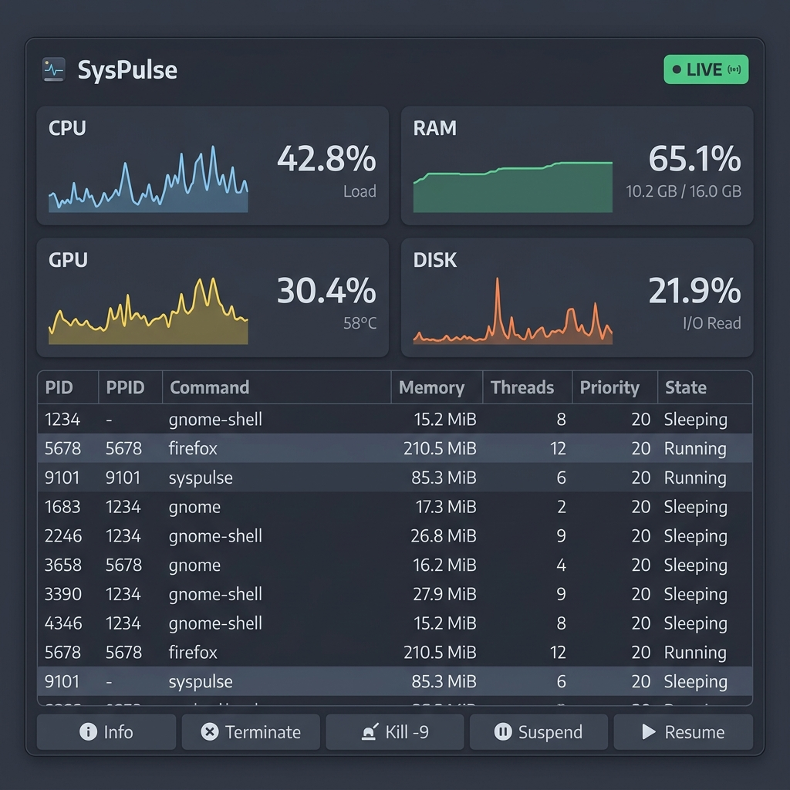

<div align="center">

# SysPulse

**A real-time Linux system monitor built with Java 25, JavaFX 23 and a native C backend**



[](LICENSE)
[](https://openjdk.org/projects/jdk/25/)
[](https://openjfx.io/)
[](#)
[](https://github.com/Rafa-x64/SysPulse/releases/tag/v1.0)

</div>

---

## What is SysPulse?

SysPulse is a lightweight, native-feeling desktop dashboard for Linux that gives you a live pulse on your machine. It reads system data directly from the Linux kernel (`/proc`, `/sys`, disk stats) through a native C shared library and surfaces everything in a clean JavaFX interface with real-time animated charts.

No bloat. No Electron. No background daemons. Just raw kernel data, rendered at 60 fps.

### What it monitors

| Metric | Source | Update rate |
|--------|--------|-------------|
| CPU usage | `/proc/stat` delta | 1 s |
| RAM usage | `/proc/meminfo` | 1 s |
| Disk I/O activity | `/proc/diskstats` delta | 1 s |
| GPU usage | `/sys/class/drm/...` | 1 s |
| Running processes | `/proc/<pid>/stat` | 1 s |

### Process management

Select any process in the table and use the bottom toolbar to:

- **Info** - view PID, PPID, memory and thread count
- **Terminate** - send SIGTERM (graceful shutdown)
- **Kill -9** - send SIGKILL (force kill)
- **Suspend** - send SIGSTOP (pause process)
- **Resume** - send SIGCONT (resume process)

---

## Requirements

| Dependency | Version | Link |
|------------|---------|------|
| Java (JDK) | 25 | [openjdk.org](https://openjdk.org/projects/jdk/25/) |
| Apache Maven | 3.9+ | [maven.apache.org](https://maven.apache.org/download.cgi) |
| GCC | Any modern version | [gcc.gnu.org](https://gcc.gnu.org/) |
| Linux kernel | 5.x+ | - |
| JavaFX | 23.0.1 (pulled by Maven) | [openjfx.io](https://openjfx.io/) |

> **GPU monitoring** works out of the box on AMD cards via `gpu_busy_percent` and on Intel integrated graphics via frequency-based estimation. NVIDIA is not currently supported.

---

## Cómo usar la aplicación (Quick Start & Run)

### 📌 Opción 1: Ejecutar directamente (Versión portable para usuarios)
Si descargaste la versión precompilada (el archivo `.rar` o `.tar.gz` con el bundle compilado), **no necesitas instalar Java ni tener herramientas de desarrollo**. 

> [!IMPORTANT]
> **Es fundamental mantener toda la estructura de carpetas extraída**. El ejecutable binario depende de las carpetas y archivos internos que se encuentran dentro de `lib/` (incluyendo la máquina virtual embebida y la librería nativa `libsysmetrics.so`).

1. **Extrae el archivo comprimido**:
   ```bash
   # Extrae el archivo en tu sistema (ej. SysPulse.rar o SysPulse.tar.gz)
   unrar x SysPulse.rar
   # o si es un tar.gz:
   tar -xzf SysPulse.tar.gz
   ```
2. **Entra en el directorio**:
   ```bash
   cd SysPulse
   ```
3. **Lanza la aplicación**:
   * **Doble Clic:** Haz doble clic sobre el archivo ejecutable `SysPulse` ubicado dentro de `bin/` usando tu gestor de archivos (Dolphin, Nautilus, etc.).
   * **Por terminal:**
     ```bash
     ./bin/SysPulse
     ```

---

## 🛠️ Desarrollo y Contribución (Para Desarrolladores)

Si deseas modificar el código fuente, agregar nuevas visualizaciones o características, puedes configurar tu entorno y compilarlo desde cero.

### Requisitos de desarrollo
* **Java JDK 25** (Se recomienda GraalVM JDK 25 para soporte nativo completo).
* **Apache Maven 3.9+**.
* **GCC** (Para compilar la librería nativa en C `sys_metrics.c`).

### 1. Clonar el repositorio
```bash
git clone https://github.com/Rafa-x64/SysPulse.git
cd SysPulse
```

### 2. Ejecutar en modo desarrollo
Puedes arrancar la aplicación de inmediato. Maven se encargará de compilar la librería en C (`libsysmetrics.so`), descargar JavaFX, compilar el código Java y lanzar el panel:
```bash
mvn javafx:run
```

### 3. Generar el ejecutable portable (jpackage)
Para generar el paquete redistribuible (el ejecutable con su propio entorno de ejecución embebido) en la carpeta `dist/`, utiliza el script automatizado que empaqueta la aplicación de forma limpia:
```bash
# Dar permisos de ejecución si no los tiene
chmod +x build-exe.sh

# Compilar y empaquetar
./build-exe.sh
```

El bundle autocontenido con todo lo necesario se generará en:
```
dist/SysPulse/
```
Esta es la carpeta completa que puedes comprimir en `.rar` o `.tar.gz` para compartirla con cualquier usuario de Linux x86_64.

---

## Project structure

```
SysPulse/
├── src/
│   └── main/
│       ├── c/
│       │   └── sys_metrics.c          # Native library: reads /proc and /sys
│       ├── java/com/rafa/
│       │   ├── App.java               # JavaFX entry point
│       │   ├── bridge/
│       │   │   └── SystemBridge.java  # FFI bridge (Panama API)
│       │   ├── model/
│       │   │   ├── SystemMetrics.java # Immutable metrics snapshot
│       │   │   ├── ProcessSnapshot.java
│       │   │   └── RawCpuTimes.java
│       │   ├── service/
│       │   │   └── SystemMonitorService.java  # Polling scheduler
│       │   ├── view/
│       │   │   ├── DashboardView.java         # UI layout and wiring
│       │   │   └── CpuChartCanvas.java        # Animated line chart canvas
│       │   └── viewmodel/
│       │       └── DashboardViewModel.java    # Observable properties
│       └── resources/com/rafa/
│           └── styles.css             # Nord-themed dark stylesheet
├── lib/                               # Compiled .so goes here (git-ignored)
├── pom.xml
├── LICENSE
└── README.md
```

---

## Architecture

SysPulse uses the [Java Foreign Function & Memory API](https://openjdk.org/jeps/454) (Project Panama) introduced in Java 22 to call the native C library without JNI boilerplate. The data flow is:

```
Linux kernel (/proc, /sys)
        |
  sys_metrics.c  (shared library compiled by GCC)
        |
  SystemBridge.java  (Panama FFI downcall handles)
        |
  SystemMonitorService.java  (virtual-thread scheduler, 1 s interval)
        |
  DashboardViewModel.java  (JavaFX ObservableProperties)
        |
  DashboardView.java  (UI, animated charts, process table)
```

The scheduler runs on a [virtual thread](https://openjdk.org/jeps/444), keeping the platform thread pool free.

---

## Contributing

Pull requests are welcome. To propose a change:

1. Fork the repository
2. Create a branch (`git checkout -b feature/your-feature`)
3. Commit your changes (`git commit -m 'Add your feature'`)
4. Push to the branch (`git push origin feature/your-feature`)
5. Open a pull request against `main`

For larger changes, open an issue first to discuss the approach.

---

## License

Released under the [MIT License](LICENSE). Do whatever you want with it.
